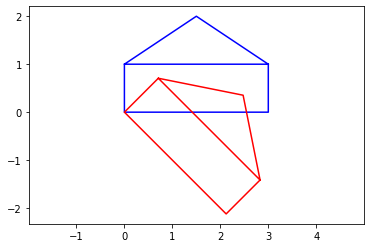

# Assignment 3 - Matrix Fun
### Author : Martin Høigaard Rasmussen
[link to python script](script.py)

[link to assignment](Assignment_matrices.pdf)


# Answers to assignment:
## Task 1
### a)
[[3 2]
 [1 6]]
### b)
[[-1  3]
 [ 4  8]]
### c)
#### @:
[[ 0 20]
 [16 56]]
#### *:
[[-3  4]
 [ 6 48]]
### d)
[[ 0 16]
 [20 56]]
### e)
[[ 0 16]
 [20 56]]
### f)
[[3 1]
 [2 6]]
### g)
[[10 12]
 [12 40]]

## Task 2
### a)
#### A@B:
[[ 5  8]
 [ 9 14]]
#### B@A:
[[ 8  5]
 [18 11]]

 By looking at the two matrices, it is clear that they are different.

## Task 3
### a)
[[ 2. -1.]
 [-3.  2.]]
### b)
[[-2.   1. ]
 [ 1.5 -0.5]]
### c)
[[1. 0.]
 [0. 1.]]
### d)
[[1. 0.]
 [0. 1.]]
### e)
[[1.00000000e+00 1.11022302e-16]
 [0.00000000e+00 1.00000000e+00]]
### f)
[[1.0000000e+00 4.4408921e-16]
 [0.0000000e+00 1.0000000e+00]]


## Task 4
### a)
error - division by zero.
Can not divide by zero.

## Task 5
```
rot = np.array([[math.cos(math.pi/4),-math.sin(math.pi/4)],[math.sin(math.pi/4),math.cos(math.pi/4)]])
```

